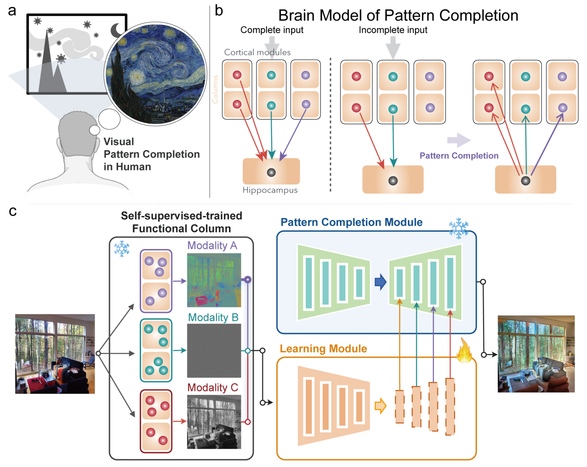

# 🤔 Learning from Pattern Completion: Self-supervised Controllable Generation

Inspired by the cortical modularization and hippocampal pattern completion, we propose a self-supervised controllable generation (**SCG**) framework to achieve pattern completion and generate images.

[](https://qizekun.github.io/shapellm/)
[](https://arxiv.org/abs/2402.17766)
[](https://github.com/tatsu-lab/stanford_alpaca/blob/main/LICENSE)
[](https://github.com/tatsu-lab/stanford_alpaca/blob/main/DATA_LICENSE)



## News

- 🍾 Sep, 2024: [**SCG**](https://qizekun.github.io/shapellm/) is accepted by NeurIPS 2024, congratulations! We will release offical version as soon, please check in homepage.
- 🎉 Apr, 2024: For those interested, we update a [pre-release code](https://gitee.com/chenzq/control-net-main) in Gitee.


## 📄 Intro

Our model is built upon our trained modular Hypercolumn-like features and ControlNet. The hypercolumn-like features are trained using a self-supervised method. Based on these features, we train several ControlNets. This approach utilizes a comprehensive modular feature set that is automatically learned and differentiated, resulting in robustness and generalization transfer capabilities. By configuring and combining appropriate control modules, it can effectively transfer to features without prior learning. We exclusively train them on the COCO dataset, yet they demonstrate the ability to generalize across various image styles, including those generated from ancient rock paintings, Chinese monochromes, oil paintings, scribbles, and more. Notably, it maintains strong performance even when dealing with lower-quality ancient rock paintings and oil paintings. 

## 🛠️ Installation

Cause our work is based on ControlNet, please refer to [ControlNet Docs](https://github.com/lllyasviel/ControlNet?tab=readme-ov-file#production-ready-pretrained-models) to install environment.


## 🚀 Quickstart

```python
python tutorial_train.py
```

## 🔧 Setting

You can modify model and dataset in `tutorial_train.py`:
```python
modelarch_path = './models/cldm_v15.yaml'
resume_path = './image_log/checkpoint_deconv_down2_3/last.ckpt'
logger_path = 'shuimo_deconv2_3_test'
dataset_name = 'MyDatasetShuimo'
```

To select different hypercolumn, refer to `./models/cldm_v15.yaml`:
```yaml
hyperconfig:
  target: cldm.cldm.HyperColumnLGN
  params: 
    hypercond: [0]
    size: 512
```

## 🖼️ Results

**To find more result, please refer to our papers.**

The first line are the origin image and the prompt. The second line are conditions of multiple hypercolumn and canny. The last line are the generated images


### Specific hypercolumn

#### Hypercolumn 0


#### Hypercolumn 1


#### Hypercolumn 2


#### Hypercolumn 3


#### Hypercolumn 4


#### Hypercolumn 5


### Painting

#### Ancient rock painting


Oil painting. The first line are the origin images. The second line are the conditions. The last line are the generated images.

- Canny


- Hypercolumn


- Scribble


#### Chinese monochromes. 

The first line are the origin images. The second line are the conditions by hypercolumn. The last two line are the generated images.


## 📌 Citation
If you find our work helpful for your research. Please consider citing our paper.

```
@article{point-gcc,
  title={Learning from Pattern Completion: Self-supervised Controllable Generation},
  author={Zhiqiang Chen, Guofan Fan, Jinying Gao, Lei Ma, Bo Lei, Tiejun Huang, Shan Yu},
  journal={arXiv preprint arXiv:2305.19623},
  year={2023}
}
```

## 📕 Acknowledgement and License

Our code is based on ControlNet. Thanks for their wonderful work!

SCG is licensed under the Apache License. See the LICENSE file for more details.
