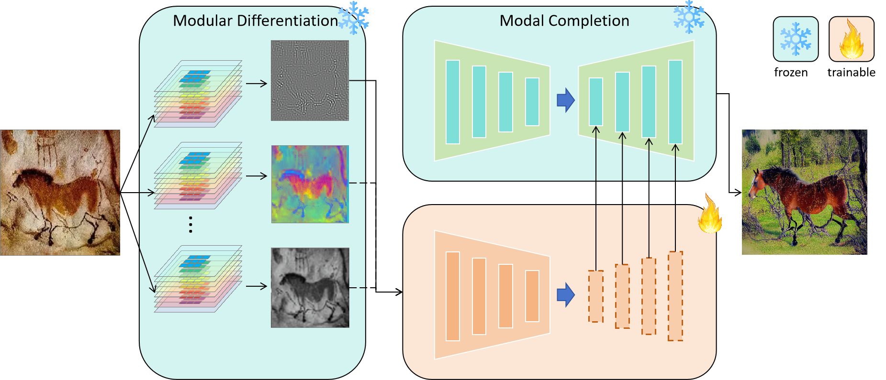

# OPEN-Vis-ControlSD

Our model is built upon our trained modular Hypercolumn-like features and ControlNet. The hypercolumn-like features are trained using a self-supervised method. Based on these features, we train several ControlNets. This approach utilizes a comprehensive modular feature set that is automatically learned and differentiated, resulting in robustness and generalization transfer capabilities. By configuring and combining appropriate control modules, it can effectively transfer to features without prior learning. We exclusively train them on the COCO dataset, yet they demonstrate the ability to generalize across various image styles, including those generated from ancient rock paintings, Chinese monochromes, oil paintings, scribbles, and more. Notably, it maintains strong performance even when dealing with lower-quality ancient rock paintings and oil paintings. 

The modular Hypercolumn-like features are shown as following:

The whole architecture is:

<!--  -->

Issues about ControlNet refer to (https://github.com/lllyasviel/ControlNet/blob/main/docs/train.md).

The checkpoint will be released soon.

# Setting

In file tutorial_train.py

modelarch_path = './models/cldm_v15.yaml'
resume_path = './image_log/checkpoint_deconv_down2_3/last.ckpt'
logger_path = 'shuimo_deconv2_3_test'
dataset_name = 'MyDatasetShuimo'

# Select Hypercolumn

In file ./models/cldm_v15.yaml

        hyperconfig:
          target: cldm.cldm.HyperColumnLGN
          params: 
            hypercond: [0]
            size: 512

# Run

python tutorial_train.py

# Results

The first line are the origin image and the prompt. The second line are conditions of multiple hypercolumn and canny. The last line are the generated images

hypercolumn 0

hypercolumn 1

hypercolumn 2

hypercolumn 3

hypercolumn 4

hypercolumn 5

Ancient rock painting:

Oil painting. The first line are the origin images. The second line are the conditions. The last line are the generated images.

Canny:

Hypercolumn:

Scribble:

Chinese monochromes. The first line are the origin images. The second line are the conditions by hypercolumn. The last two line are the generated images.

