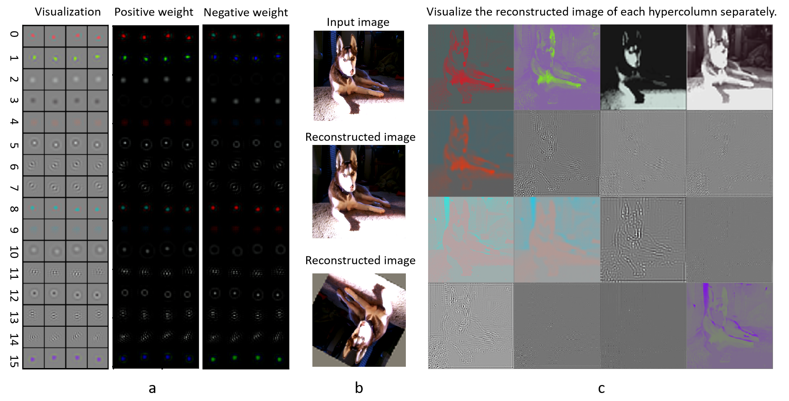

# Model architecture of OPEN-Vis-ControlSD

Our model is based our trained Hypercolumn-like features and ControlNet. The hypercolumn-like features are trained by a self-supervised method. Basing on the hypercolumn-like features, we train several controlnets and it can generalize to multiple tasks such as 

The Hypercolumn-like features are shown as following:

The whole architecture is:

Issues about ControlNet refer to (https://github.com/lllyasviel/ControlNet/blob/main/docs/train.md).

The checkpoint will be released soon.

# Run the network, set model archtecture file, checkpoint file, logger file and dataset

In file tutorial_train.py

modelarch_path = './models/cldm_v15.yaml'
resume_path = './image_log/checkpoint_deconv_down2_3/last.ckpt'
logger_path = 'shuimo_deconv2_3_test'
# dataset_name_list = ['MyDatasetCOCO','MyDatasetCOCO_canny','MyDatasetCOCO_val','MyDatasetCOCO_val_canny','MyDatasetBihua','MyDatasetBihuaCanny','MyDatasetShuimo','MyDatasetShuimoCanny']
dataset_name = 'MyDatasetShuimo'

# Set the selected hypercolumn

In file ./models/cldm_v15.yaml

        hyperconfig:
          target: cldm.cldm.HyperColumnLGN
          params: 
            hypercond: [0]
            size: 512

# Run

python tutorial_train.py 

# Results

The first line are the origin image and the prompt. The second line are conditions of multiple hypercolumn and canny. The last line are the generated images

hypercolumn 0

hypercolumn 1

hypercolumn 2

hypercolumn 3

hypercolumn 4

hypercolumn 5

Ancient murals

Oil painting. The first line are the origin images. The second line are the conditions. The last line are the generated images.

Canny:

Hypercolumn:

Scribble:

Ink painting. The first line are the origin images. The second line are the conditions by hypercolumn. The last two line are the generated images.

